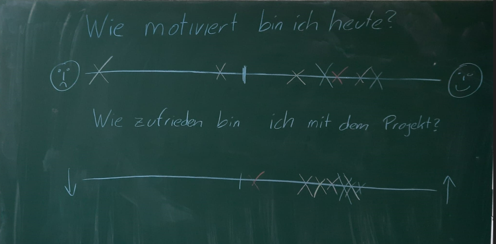
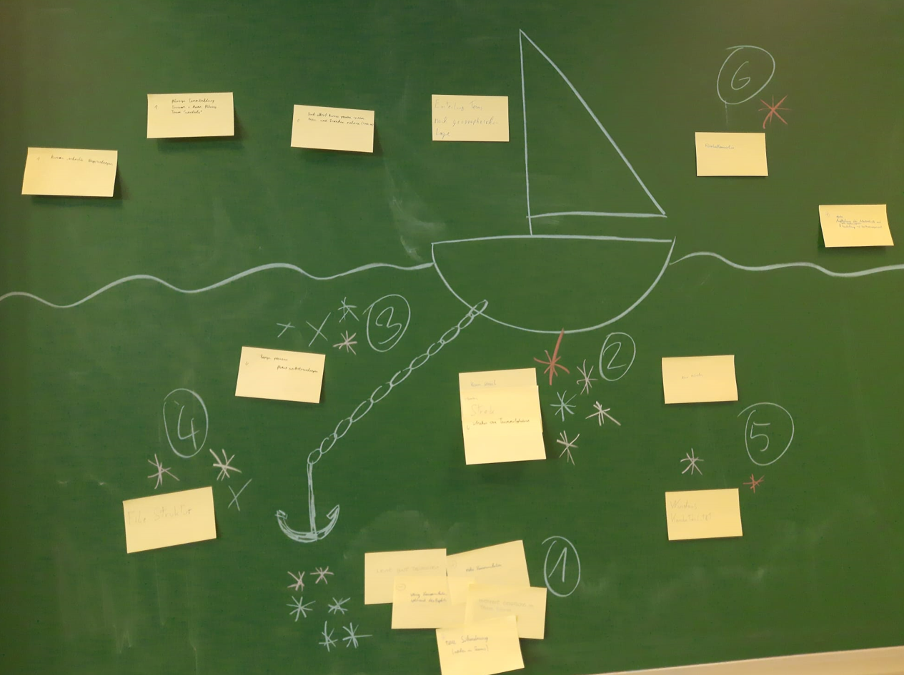

### 10.11.2022
#### Dokumentation
    Userstories
    Korrektion
    Github und OneNote zusammen

#### Front-End
    Beispiel Seite
    Heute Prototyp
    Design Einigen
    Login Page

#### Back-End
    Wetterdienste laufen
    Django aufgesetzt
    wieder src finden
    Login

#### Betrieb
    Grober Plan

#### Test
    Testen der Meilensteine des letzen mals

### 24.11.2022
#### Dokumentation
    Userstorys
    Aufholen der letzten Dokumentationen

#### Front/Back-End
    Zusammenfügen der Beiden

#### Betrieb
    Grober Plan

#### Test
    Testen der Fortschritte

#### Grafiker
    Fertigstellen der Icons

#### Teamlead
    Beginn des Pflichtenheftes

### 01.12.2022
#### Dokumentation
    Userstorys

#### Front/Back-End
    Zusammenfügen der Beiden weiterführen

#### Betrieb
    Grober Plan

#### Test
    Testen der Fortschritte

#### Grafiker
    Fertigstellen der Icons

#### Teamlead
    Weiterführen des Pflichtenheftes

### 15.12.2022
#### Dokumentation
    Userstorys und Pflichtenheft

#### Front/Back-End
    Zusammenfügen der Beiden weiterführen

#### Betrieb
    unimportant for now

#### Test
    Testen der Fortschritte

#### Grafiker
    Fertigstellen der Icons for real for real

#### Teamlead
    Weiterführen des Pflichtenheftes und Terminbesprechung

#### Probleme
    Kevin striked 09:45-13:15
    

### 12.01.2023
#### Backend
    Single Page usw.
    
#### Frontend
    Updaten
    
#### Teamlead
    Pflichtenheft updaten
    
#### Dokumentation
    Pflichtenheft weiterarbeiten
    
#### Protokoll
    Testprotokoll vorlage

#### Retrospektive

